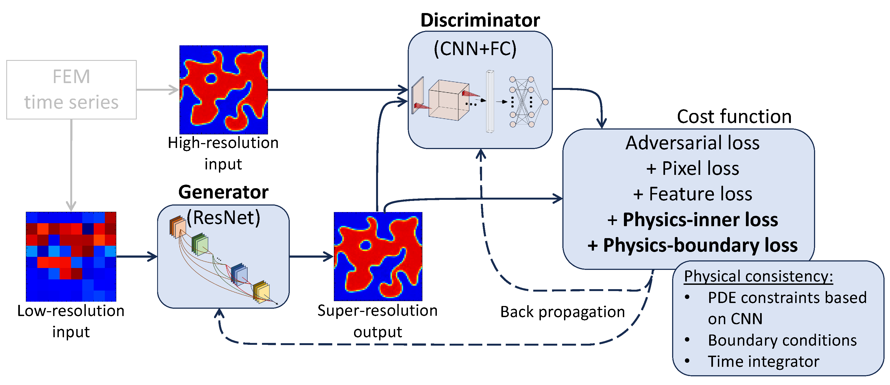
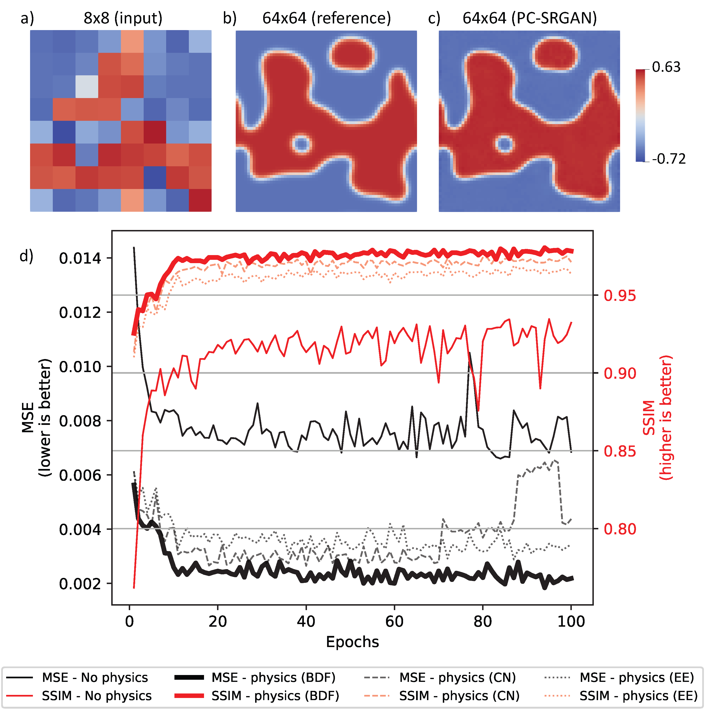

# PC-SRGAN: Physically Consistent Super-Resolution Generative Adversarial Network for General Transient Simulations

**This repository is the official implementation of the above-titled paper, currently under review for the IEEE Transactions on Pattern Analysis and Machine Intelligence (TPAMI).**

**The paper also releases [Transient Simulation Datasets Using Allen-Cahn and Eriksson-Johnson Equations](https://doi.org/10.5281/zenodo.15681249).**

&nbsp;

<div align="center">
    <a href="https://arxiv.org/abs/2505.06502">
        
    </a>
    <a href="https://arxiv.org/pdf/2505.06502">
        
    </a>
    <a href="https://doi.org/10.5281/zenodo.16250888">
        
    </a>
    <a href="https://github.com/hasan-rakibul/PC-SRGAN/stargazers">
        
    </a>
    <a href="https://github.com/hasan-rakibul/PC-SRGAN/network/members">
        
    </a>
    <a href="https://github.com/hasan-rakibul/PC-SRGAN/blob/main/LICENSE">
        
    </a>
</div>

&nbsp;
<div align="center">
    <br>
    PC-SRGAN adds physics-based constraints to the SRGAN in order to ensure that the super-resolved images are physically consistent with the underlying physics of scientific problems. It is designed for general transient simulations, such as those in fluid dynamics, heat transfer, and other time-dependent phenomena.
</div>

&nbsp;
<div align="center">
    <br>
    (a) Example low-resolution, high-resolution and super-resolved image; (b) a graph of validation MSE and SSIM with respect to training epochs for both PC-SRGAN and SRGAN. 
</div>

## Important details on using this repository
1. The dataset needs to have the following structure:
```
data
├── Allen-Cahn_Periodic
│   ├── train
│   │   ├── mesh_7
│   │   │   ├── <folders per parameter set>
│   │   │   │   ├── <npy files>
│   │   ├── mesh_63
│   │   │   ├── <folders per parameter set>
│   │   │   │   ├── <npy files>
│   ├── validation
...
│   ├── test
...
```
**Data processing steps (not required if you have got npy files with train/validation/test split):**<br>
Step 1. Generate the dataset using FEM (`src/FEM_xx.py`<br>
Step 2. Convert the generated vtk files to numpy files using `src/vtk-to-npy.py`<br>
Step 3. Split the dataset into train, validation, and test sets using `src/split_dataset.py`<br>

2. Download necessary pretrained SRGAN weight because we bootstrap the generator model from it.
```bash
bash src/SRGAN_download_weights.sh SRGAN_x8-SRGAN_ImageNet # for 8x upscaling
bash src/SRGAN_download_weights.sh SRGAN_x4-SRGAN_ImageNet # for 4x upscaling
```
3. To directly test the model, pretrained checkpoints of four experimental setups are available [here in Google Drive](https://drive.google.com/drive/folders/1MkQsvRpItVb7VaShLBVHgFmWQkbcTK1B?usp=sharing). Download and store them as the `results` directory.
3. Install necessary packages mentioned in `requirements.txt` (tested on both Python version 3.9.4 and 3.10.12)
4. Check and configure configuration files at `configs/**/*.yaml`

5. Train and test scripts

Directly run bash script:
```bash
./train_physics.sh
./train_no-physics.sh
./test_physics.sh
./test_no-physics.sh
```
Or, SLURM scripts if you need to submit a SLURM job in a HPC cluster:
```bash
sbatch job_physics.sh
sbatch job_no-physics.sh
```

## Setting up the environment
This repository was first developed on CSIRO Bracewell (`Python 3.9.4`), and later on Pawsey Setonix (`torch 2.4.1` with `ROCm 5.7.3` on `Python 3.10.12`).

### CSIRO Bracewell setup
My note on using CSIRO Bracewell is [here](https://hasan-rakibul.github.io/csiro-bracewell-for-deep-learning.html).

Python version was **3.9.4**, which can be loaded using the following command:
```bash
module load python/3.9.4
```
Inside your preferred directory (e.g.,`/scratch2/<ident>`), you can create a virtual environment (instructions can be found [here](https://hasan-rakibul.github.io/personal-note-git-linux-etc-commands.html)).

Install packages:
```bash
python -m pip install -r requirements_torch.txt
python -m pip install -r requirements.txt
```

### FeniCS _(only required for generating the dataset)_
We found it better to install through conda than pip:
```bash
conda create -n fenics python=3.9.4
conda activate fenics
conda install -c conda-forge fenics # or just conda install fenics if using miniforge3
```
### vtk _(only required for converting the vtk files to numpy files)_
Installation through pip was missing `libXrender.so.1`, but it was smooth through conda:
```bash
conda install vtk
```

## Citation
```bibtex
@misc{hasan2025pcsrgan,
    title={PC-SRGAN: Physically Consistent Super-Resolution Generative Adversarial Network for General Transient Simulations}, 
    author={Md Rakibul Hasan and Pouria Behnoudfar and Dan MacKinlay and Thomas Poulet},
    year={2025},
    eprint={2505.06502},
    archivePrefix={arXiv},
    primaryClass={eess.IV},
    url={https://arxiv.org/abs/2505.06502}, 
}

@dataset{hasan2025transient,
    author       = {Hasan, Md Rakibul and Behnoudfar, Pouria and Mackinlay, Dan and Poulet, Thomas},
    title        = {Transient Simulation Datasets Using Allen-Cahn and Eriksson-Johnson Equations},
    month        = {7},
    year         = {2025},
    publisher    = {Zenodo},
    doi          = {10.5281/zenodo.16250888}
}

```

## Acknowledgement
We are immensely grateful to the contributors of [SRGAN-PyTorch](https://github.com/Lornatang/SRGAN-PyTorch) based on which we have started developing this codebase. We are also thankful to the contributors of [ESRGAN-PyTorch](https://github.com/Lornatang/ESRGAN-PyTorch), using which we have extended PC-SRGAN to PC-ESRGAN.
